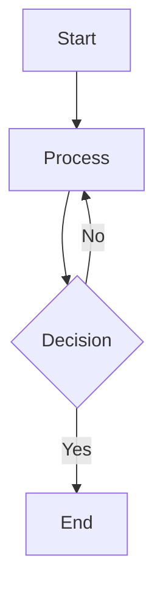

<div align = center>
  
  <h1>astro-theme-reimu</h1>
  
  
  

💘 Hakurei Reimu 💘

[Demo](https://d-sketon.github.io/astro-theme-reimu)

[简体中文](https://github.com/D-Sketon/astro-theme-reimu/blob/main/README.md) | English


</div>

---

This theme is an Astro port of [hexo-theme-reimu](https://github.com/D-Sketon/hexo-theme-reimu), a Hakurei Reimu style Astro theme.

| framework                    | repository                                                         | version                                                                                                                                                                                     | stars                                                                                              |
| ---------------------------- | ------------------------------------------------------------------ | ------------------------------------------------------------------------------------------------------------------------------------------------------------------------------------------- | -------------------------------------------------------------------------------------------------- |
| [Hexo](https://hexo.io/)     | [hexo-theme-reimu](https://github.com/D-Sketon/hexo-theme-reimu)   |   |   |
| [Hugo](https://gohugo.io)    | [hugo-theme-reimu](https://github.com/D-Sketon/hugo-theme-reimu)   |   |   |
| [Astro](https://astro.build) | [astro-theme-reimu](https://github.com/D-Sketon/astro-theme-reimu) |  |  |

**Issues and PRs are welcome!**

## Lighthouse

<p align="center">
  <a href="https://pagespeed.web.dev/analysis/https-d-sketon-github-io-astro-theme-reimu/ur4yncrgnm?form_factor=desktop">
    
  </a>
</p>

## Features

### Core Features

- ✨ Complete blog functionality
- 📱 Responsive layout
- 🌙 Dark mode support
- 🌍 Multi-language support (i18n)

### Code & Math

- 🖥️ Code highlighting (based on Expressive Code)
- ➗ KaTeX math formula support
- 📊 Mermaid flowchart support

### Search & Comments

- 🔍 Local search (based on Fuse.js)
- 💬 Multiple comment systems support:
  - Valine
  - Waline
  - Twikoo
  - Gitalk
  - Giscus
  - Disqus
  - Utterances

### Statistics & Analytics

- 📊 Article reading statistics (Waline/Valine)
- 👥 Visitor statistics (busuanzi)
- 📈 Website analytics:
  - Baidu Analytics
  - Google Analytics
  - Clarity

### Media & Interaction

- 🖼️ Image lazy loading
- 🖼️ Image lightbox
- ⚡ Loading animation
- 🎨 AOS scroll animation
- 🎯 Mouse effects

### Navigation & Structure

- 📑 Table of contents
- 📰 RSS feed

### Design & Customization

- 🎨 Icon support (FontAwesome, Iconify)
- 🔗 Built-in MDX components:
  - Internal links
  - External links
  - Friend links
  - Heat map
  - Tag roulette
  - Tabs
  - Photo gallery
- ©️ Article copyright notice
- 🌐 Responsive banner (srcset)
- 🎨 Share card functionality

## Installation & Usage

### Quick Start

```bash
# Clone the repository
git clone https://github.com/D-Sketon/astro-theme-reimu.git
cd astro-theme-reimu

# Install dependencies (pnpm recommended)
pnpm install

# Start development server
pnpm run dev

# Build for production
pnpm run build

# Preview build
pnpm run preview
```

### Project Structure

```plain
/
├── public/              # Static assets
│   ├── images/
│   │   ├── banner.webp
│   │   ├── banner-800w.webp
│   │   ├── banner-600w.webp
│   │   ├── favicon.ico
│   │   ├── reimu.png
│   │   └── taichi.png
│   └── robots.txt
├── src/
│   ├── components/      # Astro/React components
│   ├── content/         # Content collections
│   │   ├── blog/        # Blog posts
│   │   └── config.ts    # Content collection config
│   ├── hooks/           # React Hooks
│   ├── languages/       # i18n language files
│   │   ├── en.ts
│   │   ├── zh-cn.ts
│   │   ├── zh-tw.ts
│   │   └── ja.ts
│   ├── layouts/         # Page layouts
│   ├── pages/           # Page routes
│   │   ├── about.mdx    # About page
│   │   ├── archives/    # Archive pages
│   │   ├── blog/        # Blog pages
│   │   ├── categories/  # Category pages
│   │   ├── tags/        # Tag pages
│   │   └── rss.xml.js   # RSS feed
│   ├── plugins/         # Markdown plugins
│   ├── styles/          # Style files
│   ├── utils/           # Utility functions
│   ├── config.ts        # Theme config
│   ├── covers.ts        # Cover images config
│   └── env.d.ts
├── astro.config.mjs     # Astro config
├── package.json
└── tsconfig.json
```

Any static assets (such as images) can be placed in the `public/` directory.  
All blog posts are stored in the `src/content/blog` directory, and the about page is stored in the `src/pages` directory.

## Configuration

Edit `src/config.ts` to configure the theme:

<details>
<summary>Basic Configuration</summary>

##### Site Information

```typescript
export default {
  site: {
    title: "My Blog", // Site title
    subtitle: "My Blog Subtitle", // Site subtitle
    description: "Your blog description", // Site description
    keywords: "blog, astro, theme", // Keywords
    author: "Your Name", // Author name
    language: "zh-CN", // Site language (en | zh-CN | zh-TW | ja)
  },
};
```

##### Sidebar

```typescript
export default {
  sidebar: {
    avatar: "/images/avatar.webp", // Avatar path (relative to public directory)
    position: "right", // Sidebar position (left | right)
  },
};
```

##### Sidebar Widgets

```typescript
export default {
  widgets: [
    "category", // Categories
    "tag", // Tags
    "tagcloud", // Tag cloud
    "archive", // Archives
    "recent_posts", // Recent posts
  ],
};
```

##### Navigation Menu

```typescript
export default {
  menu: [
    { name: "home", url: "/" }, // Menu item name (corresponds to i18n translation)
    { name: "archives", url: "/archives" },
    { name: "about", url: "/about" },
  ],
};
```

##### Banner & Cover

###### Banner Configuration

```typescript
export default {
  banner: "/images/banner.webp", // Banner path

  // Responsive banner (optional)
  banner_srcset: {
    enable: true,
    srcset: [
      { src: "/images/banner-600w.webp", media: "(max-width: 479px)" },
      { src: "/images/banner-800w.webp", media: "(max-width: 799px)" },
      { src: "/images/banner.webp", media: "(min-width: 800px)" },
    ],
  },
};
```

###### Cover Configuration

Configure random cover image list in `src/covers.ts`:

```typescript
export default [
  "https://example.com/cover1.webp",
  "https://example.com/cover2.webp",
  "https://example.com/cover3.webp",
];
```

Article cover display logic:

1. If `cover` is specified in the article's Front Matter, use the specified cover
2. Otherwise, randomly select one from `covers.ts`
3. If `covers.ts` is empty, use the banner as cover

##### Footer

```typescript
export default {
  footer: {
    since: 2020, // Start year (displays as 2020 - current year)
    powered: true, // Show "Powered by Astro"
    count: true, // Show article statistics
    busuanzi: true, // Enable busuanzi visitor statistics
    icp: {
      icpnumber: "", // ICP license number
      beian: "", // Public security record number
      recordcode: "", // Public security record link recordcode parameter
    },
    moe_icp: {
      icpnumber: "", // Moe ICP license number
    },
  },
};
```

##### Social Links

```typescript
export default {
  social: {
    email: "mailto:your@email.com",
    github: "https://github.com/yourname",
    twitter: "https://twitter.com/yourname",
    facebook: "https://www.facebook.com/yourname",
    // More social platforms...
  },
};
```

</details>

<details>
<summary>Comment Systems</summary>

##### Waline

[Waline](https://waline.js.org/) is a simple and secure comment system.

```typescript
export default {
  waline: {
    enable: true,
    serverURL: "your-server-url", // Waline server URL
    lang: "zh-CN", // Language
    locale: {}, // Custom locale
    emoji: [
      // Emoji sets
      "https://unpkg.com/@waline/emojis@1.2.0/weibo",
      "https://unpkg.com/@waline/emojis@1.2.0/bilibili",
    ],
    meta: ["nick", "mail", "link"], // Commenter info
    requiredMeta: ["nick", "mail"], // Required fields
    wordLimit: 0, // Comment word limit (0 for unlimited)
    pageSize: 10, // Comments per page
    pageview: true, // Enable pageview statistics
  },
};
```

##### Valine

[Valine](https://valine.js.org/) is a fast, simple and efficient serverless comment system based on LeanCloud.

```typescript
export default {
  valine: {
    enable: true,
    appId: "your-app-id", // LeanCloud App ID
    appKey: "your-app-key", // LeanCloud App Key
    pageSize: 10, // Comment list pagination
    avatar: "mp", // Gravatar avatar style
    lang: "zh-cn", // Language
    placeholder: "Just go go", // Comment box placeholder
    guest_info: "nick,mail,link", // Commenter info fields
    recordIP: true, // Record commenter IP
    highlight: true, // Highlight code blocks
    visitor: false, // Show visitor count
    serverURLs: "", // LeanCloud server URL (optional)
  },
};
```

##### Gitalk

[Gitalk](https://gitalk.github.io/) is a modern comment component based on GitHub Issue and Preact.

```typescript
export default {
  gitalk: {
    enable: true,
    clientID: "your-client-id", // GitHub Application Client ID
    clientSecret: "your-client-secret", // GitHub Application Client Secret
    repo: "your-repo", // GitHub repository for storing comments
    owner: "your-name", // Repository owner
    admin: ["your-name"], // Repository admin (can be array)
  },
};
```

##### Giscus

[Giscus](https://giscus.app/en) is a comment system powered by GitHub Discussions.

```typescript
export default {
  giscus: {
    enable: true,
    repo: "your-username/your-repo", // GitHub repository
    repoId: "your-repo-id", // Repository ID
    category: "your-category", // Category name
    categoryId: "your-category-id", // Category ID
    mapping: "pathname", // Comment mapping
    strict: 0, // Strict mode
    reactionsEnabled: 1, // Enable reactions
    emitMetadata: 0, // Emit metadata
    inputPosition: "bottom", // Input position
  },
};
```

##### Twikoo

[Twikoo](https://twikoo.js.org/) supports multiple deployment methods for comment systems.

```typescript
export default {
  twikoo: {
    enable: true,
    envId: "your-env-id", // Tencent Cloud environment ID；Vercel environment uses address (https://xxx.vercel.app)
    region: "", // Tencent Cloud region (optional)
  },
};
```

##### Utterances

[Utterances](https://utteranc.es/) is a lightweight comment component based on GitHub Issues.

```typescript
export default {
  utterances: {
    enable: true,
    repo: "owner/repo", // GitHub repository
    issue_term: "title", // Issue mapping
    theme: "github-light", // Theme
  },
};
```

##### Disqus

[Disqus](https://disqus.com/) is a global comment system.

```typescript
export default {
  disqus: {
    enable: true,
    shortname: "your-shortname", // Disqus shortname
    count: true, // Enable comment count statistics
  },
};
```

</details>

<details>
<summary>Analytics & Statistics</summary>

##### Website Analytics

```typescript
export default {
  analytics: {
    baidu_analytics: "your-baidu-id", // Baidu Analytics ID
    google_analytics: "your-ga-id", // Google Analytics ID
    clarity: "your-clarity-id", // Microsoft Clarity ID
  },
};
```

</details>

<details>
<summary>Other Features</summary>

##### Copyright Notice

```typescript
export default {
  copyright: {
    enable: true, // Enable copyright notice
    content: {
      author: true, // Show author
      link: true, // Show article link
      title: true, // Show article title
      date: false, // Show publish date
      updated: false, // Show update date
      license: true, // Show license
      license_type: "by-nc-sa", // License type
    },
  },
};
```

##### Loading Animation

```typescript
export default {
  preloader: {
    enable: true, // Enable loading animation
    text: "少女祈祷中...", // Loading text
    rotate: true, // Rotate icon
  },
};
```

##### Friend Links

```typescript
export default {
  friend: [
    {
      name: "Friend Name", // Friend name
      url: "https://friend.com", // Friend URL
      desc: "Description", // Friend description
      avatar: "/avatar.webp", // Friend avatar
    },
  ],
};
```

##### Home Category Cards

```typescript
export default {
  home_categories: {
    enable: true, // Enable home category cards
    content: [
      {
        categories: "Blog", // Category name
        cover: "/images/category-cover.webp", // Category cover (optional)
      },
    ],
  },
};
```

##### Share Functionality

```typescript
export default {
  share: [
    "weibo", // Weibo
    "qq", // QQ
    "weixin", // WeChat
    // "twitter",  // Twitter
    // "facebook", // Facebook
    // "linkedin", // LinkedIn
    // "reddit",   // Reddit
  ],
};
```

##### Sponsorship

```typescript
export default {
  sponsor: {
    enable: false, // Enable sponsorship
    qr: [
      { name: "Alipay", src: "/sponsor/alipay.jpg" },
      { name: "WeChat", src: "/sponsor/wechat.png" },
    ],
  },
};
```

##### Article Expiration Reminder

```typescript
export default {
  outdate: {
    enable: false, // Enable article expiration reminder
    daysAgo: 180, // Days after which articles are considered expired
  },
};
```

##### Mouse Effects

```typescript
export default {
  firework: {
    enable: true, // Enable mouse effects
    disable_on_mobile: false, // Disable on mobile
    options: {
      // Detailed configuration please refer to mouse-firework documentation
    },
  },
};
```

##### Triangle Badge

```typescript
export default {
  triangle_badge: {
    enable: false,
    type: "github", // Icon type
    link: "https://github.com/yourname",
  },
};
```

</details>

## Writing

<details>
<summary>Creating Articles</summary>

Create `.md` or `.mdx` files in the `src/content/blog/` directory:

```markdown
---
title: Your Article Title
description: Article description
pubDate: 2024-01-01
updatedDate: 2024-01-02
cover: https://example.com/cover.jpg
tags:
  - tag1
  - tag2
categories:
  - category1
---

Your article content...
```

</details>

<details>
<summary>Front Matter Fields</summary>

#### Front Matter Fields

| Field       | Description                   | Type                 | Required | Default |
| ----------- | ----------------------------- | -------------------- | -------- | ------- |
| title       | Article title                 | `string`             | Yes      | -       |
| description | Article description (for SEO) | `string`             | Yes      | -       |
| keywords    | Article keywords (for SEO)    | `string[] \| string` | No       | `[]`    |
| pubDate     | Publish date                  | `Date`               | Yes      | -       |
| updatedDate | Update date                   | `Date`               | No       | -       |
| cover       | Cover image URL               | `string`             | No       | -       |
| tags        | Tag list                      | `string[]`           | No       | `[]`    |
| categories  | Category list                 | `string[]`           | No       | `[]`    |
| excerpt     | Article excerpt               | `string`             | No       | -       |
| comment     | Enable comment system         | `boolean`            | No       | `true`  |
| author      | Article author                | `string`             | No       | -       |
| toc         | Show table of contents        | `boolean`            | No       | `true`  |
| sponsor     | Show sponsorship info         | `boolean`            | No       | -       |
| copyright   | Show copyright notice         | `boolean`            | No       | -       |
| share       | Show share buttons            | `boolean`            | No       | -       |
| outdated    | Article is outdated           | `boolean`            | No       | `false` |

</details>

<details>
<summary>Math Formulas</summary>

The theme has built-in KaTeX support. You can use LaTeX syntax directly in Markdown:

#### Inline Formula

```markdown
Inline formula: $E = mc^2$
```

#### Block Formula

```markdown
Block formula:

$$
\frac{n!}{k!(n-k)!} = \binom{n}{k}
$$
```

</details>

<details>
<summary>Mermaid Flowcharts</summary>

The theme has built-in Mermaid support:

````markdown

````

</details>

<details>
<summary>Code Blocks</summary>

Code blocks are implemented based on [Expressive Code](https://expressive-code.com/), supporting:

- Syntax highlighting
- Line numbers
- Code folding (using `collapse` marker)
- Copy button

#### Basic Code Block

````markdown
```javascript
function hello() {
  console.log("Hello, World!");
}
```
````

#### Code Folding

````markdown
```js collapse={1-5, 12-14}
// These lines are collapsed by default
function example() {
  console.log("Hello");
}

// These lines are expanded by default
const result = example();
```
````

</details>

<details>
<summary>Built-in Components</summary>

The theme provides rich built-in MDX components:

#### Link Components

##### Internal Links

Creates beautiful link cards for other articles with cover images and summaries. Suitable for recommending related content or creating content navigation within articles.

```markdown
<Link slug="post-slug" title="Article Title" cover="Cover URL" />
```

**Props:**

- `slug` (`string`, optional): Article slug
- `url` (`string`, optional): External link URL
- `title` (`string`, optional): Link title
- `cover` (`string | "auto"`, optional): Cover image

##### External Links

Creates beautiful link cards for external websites, automatically recognized as external links. Suitable for sharing external resources or recommending other websites within articles.

```markdown
<Link url="https://github.com" title="GitHub" cover="auto" />
```

#### Content Components

##### Friend Link Cards

Displays a list of friend links, each containing avatar, name, and description. Suitable for showcasing partner websites on about pages or dedicated friend link pages.

Friend link cards use the friend link list from global configuration:

```markdown
<FriendCard />
```

**Props:** None

##### Heat Map Card

Generates a heat map visualization based on visit data, showing content activity. Suitable for displaying visit data on personal homepages or statistical pages.

```markdown
<HeatMapCard levelStandard="1000,5000,10000" />
```

**Props:**

- `levelStandard` (`string`, optional): Level standards, default "1000,5000,10000"

##### Tag Roulette

Displays a tag list in roulette form, allowing users to randomly select tags by clicking. Suitable for adding fun interaction on tag pages or sidebars.

```markdown
<TagRoulette tags="tag1,tag2,tag3" icon="🎯" />
```

**Props:**

- `tags` (`string`, optional): Tag list separated by commas, defaults to preset tags
- `icon` (`string`, optional): Button icon, default "🕹️"

#### Layout Components

##### Tabs

Creates a multi-tab interface for displaying different content in the same area. Suitable for showing multiple aspects of related content or tabbed navigation.

```markdown
<Tabs active={1} center={false}>
  <TabItem title="Tab 1">Content 1</TabItem>
  <TabItem title="Tab 2">Content 2</TabItem>
</Tabs>
```

**Tabs Props:**

- `active` (`number`, optional): Default active tab, default 1
- `center` (`boolean`, optional): Center alignment, default false

**TabItem Props:**

- `title` (`string`, required): Tab title

##### Details

Creates an expandable/collapsible content area to hide secondary information. Suitable for displaying detailed explanations, code examples, or long text content.

```markdown
<Details summary="Click to expand">
  Content here
</Details>
```

**Props:**

- `summary` (`string`, required): Collapse title

##### Grid Layout

Creates a responsive grid layout for flexible content arrangement. Suitable for displaying card lists, image grids, or equal-width content blocks.

```markdown
<Grid col={3}>
  <GridCell>Cell 1</GridCell>
  <GridCell>Cell 2</GridCell>
  <GridCell>Cell 3</GridCell>
</Grid>
```

**Grid Props:**

- `width` (`number`, optional): Minimum width, default 240
- `col` (`number`, optional): Number of columns, takes precedence over width

**GridCell Props:** None

##### Photo Gallery

Creates a beautiful image display wall with lightbox effects. Suitable for displaying multiple images in articles or creating image collection pages.

```markdown
<Gallery>
  
  
</Gallery>
```

**Props:** None

##### Alert Block

Creates different types of prompt information boxes with various styles. Suitable for highlighting important information, warnings, or prompting user attention.

```markdown
<AlertBlockquote type="info" title="Tip">
  This is an info tip
</AlertBlockquote>

<AlertBlockquote type="warning">
  This is a warning tip
</AlertBlockquote>

<AlertBlockquote type="danger">
  This is a danger tip
</AlertBlockquote>
```

**Props:**

- `type` (`"info" | "warning" | "danger" | "tip" | "important"`, optional): Alert type, default "info"
- `title` (`string`, optional): Custom title, defaults to type in uppercase

</details>

## Deployment

### Configure Site Information

Edit `astro.config.mjs`:

```javascript
export default defineConfig({
  site: "https://yourusername.github.io", // Your site URL
  base: "your-repo-name", // Subpath (for GitHub Pages deployment)
  // ...
});
```

### GitHub Pages

1. Build the project:

```bash
pnpm run build
```

2. Deploy the `dist/` directory to GitHub Pages

Or configure GitHub Actions for automatic deployment (recommended). See [GitHub Pages](https://docs.astro.build/en/guides/deploy/github/) for details.

### Vercel / Netlify

These platforms automatically recognize Astro projects:

1. Connect your GitHub repository
2. The platform will automatically detect and use the correct build commands
3. Click deploy. See [Netlify](https://docs.astro.build/en/guides/deploy/netlify/) or [Vercel](https://docs.astro.build/en/guides/deploy/vercel/) documentation for details.

## Development

### Adding New Pages

Create files in the `src/pages/` directory, and Astro will automatically handle routing.

### Modifying Styles

Style files are located in the `src/styles/` directory:

- `base.stylus` - Base styles
- `global.css` - Global styles
- `markdown.stylus` - Markdown rendering styles
- Other style files...

### i18n

Language files are located in the `src/languages/` directory. Supported languages:

- `en.ts` - English
- `zh-cn.ts` - Simplified Chinese
- `zh-tw.ts` - Traditional Chinese
- `ja.ts` - Japanese

To add a new language, create a corresponding `.yml` file and refer to the structure of existing files.

## Contributors

[](https://github.com/D-Sketon/astro-theme-reimu/graphs/contributors)

## Star History

[](https://www.star-history.com/#D-Sketon/astro-theme-reimu&type=date&legend=top-left)

## License

MIT

[](https://app.fossa.com/projects/git%2Bgithub.com%2FD-Sketon%2Fastro-theme-reimu?ref=badge_large)
