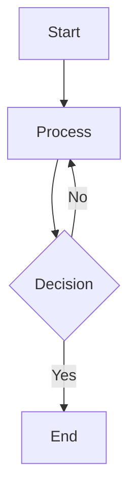

<div align = center>
  
  <h1>astro-theme-reimu</h1>
  
  
  

💘 Hakurei Reimu 💘

[Demo](https://d-sketon.github.io/astro-theme-reimu)

[简体中文](https://github.com/D-Sketon/astro-theme-reimu/blob/main/README.md) | English


</div>

---

This theme is an Astro port of [hexo-theme-reimu](https://github.com/D-Sketon/hexo-theme-reimu), a Hakurei Reimu style Astro theme.

| framework                    | repository                                                         | version                                                                                                                                                                                     | stars                                                                                              |
| ---------------------------- | ------------------------------------------------------------------ | ------------------------------------------------------------------------------------------------------------------------------------------------------------------------------------------- | -------------------------------------------------------------------------------------------------- |
| [Hexo](https://hexo.io/)     | [hexo-theme-reimu](https://github.com/D-Sketon/hexo-theme-reimu)   |   |   |
| [Hugo](https://gohugo.io)    | [hugo-theme-reimu](https://github.com/D-Sketon/hugo-theme-reimu)   |   |   |
| [Astro](https://astro.build) | [astro-theme-reimu](https://github.com/D-Sketon/astro-theme-reimu) |  |  |

**Issues and PRs are welcome!**

## Lighthouse

<p align="center">
  <a href="https://pagespeed.web.dev/analysis/https-d-sketon-github-io-astro-theme-reimu/ur4yncrgnm?form_factor=desktop">
    
  <a>
</p>

## Features

### Core Features

- ✨ Complete blog functionality
- 📱 Responsive layout
- 🌙 Dark mode support

### Code & Math

- 🖥️ Code highlighting (based on Expressive Code)
- ➗ KaTeX math formula support
- 📊 Mermaid flowchart support

### Search & Comments

- 🔍 Local search (based on Fuse.js)
- 💬 Multiple comment systems:
  - Valine
  - Waline
  - Gitalk

### Statistics & Analytics

- 📊 Article reading statistics (Waline/Valine)
- 👥 Visitor statistics (busuanzi)
- 📈 Website analytics:
  - Baidu Analytics
  - Google Analytics
  - Clarity

### Media & Interaction

- 🖼️ Image lazy loading (lozad)
- 🖼️ Image lightbox (baguetteBox)
- ⚡ Loading animation
- 🎨 AOS scroll animation

### Navigation & Structure

- 📑 Table of contents
- 📰 RSS feed

### Design & Customization

- 🎨 Icon support (FontAwesome, Iconify)
- ©️ Article copyright notice
- 🌐 Responsive banner (srcset)

## Installation & Usage

### Quick Start

```bash
# Clone the repository
git clone https://github.com/D-Sketon/astro-theme-reimu.git
cd astro-theme-reimu

# Install dependencies (pnpm recommended)
pnpm install
# or use npm
npm install

# Start dev server
pnpm run dev
# or
npm run dev

# Build for production
pnpm run build
# or
npm run build

# Preview build
pnpm run preview
# or
npm run preview
```

### Project Structure

```txt
/
├── public/              # Static assets
│   ├── images/
│   │   ├── banner.webp
│   │   ├── banner-800w.webp
│   │   ├── banner-600w.webp
│   │   ├── favicon.ico
│   │   ├── reimu.png
│   │   └── taichi.png
│   └── robots.txt
├── src/
│   ├── components/      # Astro/React components
│   ├── content/         # Content collections
│   │   ├── blog/        # Blog posts
│   │   └── config.ts    # Content collection config
│   ├── hooks/           # React Hooks
│   ├── languages/       # i18n language files
│   │   ├── en.yml
│   │   ├── zh-cn.yml
│   │   ├── zh-tw.yml
│   │   └── ja.yml
│   ├── layouts/         # Page layouts
│   ├── pages/           # Page routes
│   │   ├── about.mdx    # About page
│   │   ├── archives/    # Archive pages
│   │   ├── blog/        # Blog pages
│   │   ├── categories/  # Category pages
│   │   ├── tags/        # Tag pages
│   │   └── rss.xml.js   # RSS feed
│   ├── plugins/         # Markdown plugins
│   ├── styles/          # Style files
│   ├── utils/           # Utility functions
│   ├── config.yml       # Theme config
│   ├── covers.yml       # Cover images config
│   └── env.d.ts
├── astro.config.mjs     # Astro config
├── package.json
└── tsconfig.json
```

Any static assets (such as images) can be placed in the `public/` directory.  
All blog posts are stored in the `src/content/blog` directory, and the about page is stored in the `src/pages` directory.

## Configuration

### Basic Configuration

Edit `src/config.yml` to configure the theme:

<details>
<summary>Site Information</summary>

```yaml
site:
  title: My Blog              # Site title
  subtitle: My Blog Subtitle  # Site subtitle
  description: Your blog description  # Site description
  keywords: blog, astro, theme  # Keywords
  author: Your Name           # Author name
  language: zh-CN             # Site language (en | zh-CN | zh-TW | ja)
```

</details>

<details>
<summary>Sidebar</summary>

```yaml
sidebar:
  avatar: /images/avatar.webp  # Avatar path (relative to public directory)
  position: right              # Sidebar position (left | right)
```

</details>

<details>
<summary>Menu Navigation</summary>

```yaml
menu:
  - name: home        # Menu item name (corresponds to i18n translation)
    url: /            # Link URL
  - name: archives
    url: /archives
  - name: about
    url: /about
```

</details>

<details>
<summary>Banner & Cover</summary>

#### Banner Configuration

```yaml
banner: "/images/banner.webp"  # Banner path

# Responsive banner (optional)
banner_srcset:
  enable: true
  srcset:
    - src: "/images/banner-600w.webp"
      media: "(max-width: 479px)"
    - src: "/images/banner-800w.webp"
      media: "(max-width: 799px)"
    - src: "/images/banner.webp"
      media: "(min-width: 800px)"
```

#### Cover Configuration

Configure random cover image list in `src/covers.yml`:

```yaml
- https://example.com/cover1.webp
- https://example.com/cover2.webp
- https://example.com/cover3.webp
```

Article cover display logic:
1. If `cover` is specified in the article's Front Matter, use the specified cover
2. Otherwise, randomly select one from `covers.yml`
3. If `covers.yml` is empty, use the banner as cover

</details>

<details>
<summary>Footer</summary>

```yaml
footer:
  since: 2020      # Start year (displays as 2020 - current year)
  powered: true    # Show "Powered by Astro"
  count: true      # Show article statistics
  busuanzi: true   # Enable busuanzi visitor statistics
```

</details>

<details>
<summary>Social Links</summary>

```yaml
social:
  email: mailto:your@email.com
  github: https://github.com/yourname
  twitter: https://twitter.com/yourname
  facebook: https://www.facebook.com/yourname
  # More platforms...
```

</details>

### Comment System

<details>
<summary>Waline</summary>

[Waline](https://waline.js.org/) is a simple and secure comment system.

```yaml
waline:
  enable: true
  serverURL: your-server-url  # Waline server URL
  lang: zh-CN                 # Language
  locale: {}                  # Custom locale
  emoji:                      # Emoji sets
    - https://unpkg.com/@waline/emojis@1.2.0/weibo
    - https://unpkg.com/@waline/emojis@1.2.0/bilibili
  meta:                       # Commenter info
    - nick
    - mail
    - link
  requiredMeta:               # Required fields
    - nick
    - mail
  wordLimit: 0                # Comment word limit (0 for unlimited)
  pageSize: 10                # Comments per page
  pageview: true              # Enable pageview statistics
```

</details>

<details>
<summary>Valine</summary>

[Valine](https://valine.js.org/) is a fast, simple and efficient serverless comment system based on LeanCloud.

```yaml
valine:
  enable: true
  appId: your-app-id          # LeanCloud App ID
  appKey: your-app-key        # LeanCloud App Key
  pageSize: 10                # Comment list pagination
  avatar: mp                  # Gravatar avatar style
  lang: zh-cn                 # Language
  placeholder: Just go go     # Comment box placeholder
  guest_info: nick,mail,link  # Commenter info fields
  recordIP: true              # Record commenter IP
  highlight: true             # Highlight code blocks
  visitor: false              # Show visitor count
  serverURLs:                 # LeanCloud server URL (optional)
```

</details>

<details>
<summary>Gitalk</summary>

[Gitalk](https://gitalk.github.io/) is a modern comment component based on GitHub Issue and Preact.

```yaml
gitalk:
  enable: true
  clientID: your-client-id        # GitHub Application Client ID
  clientSecret: your-client-secret # GitHub Application Client Secret
  repo: your-repo                 # GitHub repository for storing comments
  owner: your-name                # Repository owner
  admin: your-name                # Repository admin (can be array)
```

</details>

### Analytics & Statistics

<details>
<summary>Website Analytics</summary>

```yaml
analytics:
  baidu_analytics: your-baidu-id    # Baidu Analytics ID
  google_analytics: your-ga-id      # Google Analytics ID
  clarity: your-clarity-id          # Microsoft Clarity ID
```

</details>

### Other Features

<details>
<summary>Copyright Notice</summary>

```yaml
copyright:
  enable: true      # Enable copyright notice
  content:
    author: true    # Show author
    link: true      # Show article link
    title: true     # Show article title
    date: false     # Show publish date
    updated: false  # Show update date
    license: true   # Show license
```

</details>

<details>
<summary>Loading Animation</summary>

```yaml
preloader:
  enable: true              # Enable loading animation
  text: 少女祈祷中...        # Loading text
  rotate: true              # Rotate icon
```

</details>

<details>
<summary>Friend Links</summary>

```yaml
friend:
  - name: Friend Name       # Friend name
    url: https://friend.com # Friend URL
    desc: Description       # Friend description
    avatar: /avatar.webp    # Friend avatar
```

</details>

## Writing

### Creating Articles

Create `.md` or `.mdx` files in the `src/content/blog/` directory:

```markdown
---
title: Your Article Title
description: Article description
pubDate: 2024-01-01
updatedDate: 2024-01-02
cover: https://example.com/cover.jpg
tags:
  - tag1
  - tag2
categories:
  - category1
---

Your article content...
```

### Front Matter Fields

| Field       | Description                   | Type               | Required | Default |
| ----------- | ----------------------------- | ------------------ | -------- | ------- |
| title       | Article title                 | string             | Yes      | -       |
| description | Article description (for SEO) | string             | No       | -       |
| keywords    | Article keywords (for SEO)    | string[] \| string | No       | []      |
| pubDate     | Publish date                  | Date               | Yes      | -       |
| updatedDate | Update date                   | Date               | No       | -       |
| cover       | Cover image URL               | string             | No       | -       |
| tags        | Tag list                      | string[]           | No       | []      |
| categories  | Category list                 | string[]           | No       | []      |
| excerpt     | Article excerpt               | string             | No       | -       |
| comment     | Enable comment system         | boolean            | No       | true    |

### Math Formulas

The theme has built-in KaTeX support. You can use LaTeX syntax directly in Markdown:

```markdown
Inline formula: $E = mc^2$

Block formula:

$$
\frac{n!}{k!(n-k)!} = \binom{n}{k}
$$
```

### Mermaid Flowcharts

The theme has built-in Mermaid support:

````markdown

````

### Code Blocks

Code blocks are implemented based on [Expressive Code](https://expressive-code.com/), supporting:

- Syntax highlighting
- Line numbers
- Code folding (using `collapse` marker)
- Copy button

Example:

````markdown
```js collapse={1-5, 12-14}
// These lines are collapsed by default
function example() {
  console.log("Hello");
}

// These lines are expanded by default
const result = example();
```
````

## Deployment

### Configure Site Information

Edit `astro.config.mjs`:

```javascript
export default defineConfig({
  site: 'https://yourusername.github.io',  // Your site URL
  base: 'your-repo-name',                  // Subpath (for GitHub Pages deployment)
  // ...
});
```

### GitHub Pages

1. Build the project:

```bash
pnpm run build
```

2. Deploy the `dist/` directory to GitHub Pages

Or configure GitHub Actions for automatic deployment (recommended). See [GitHub Pages](https://docs.astro.build/en/guides/deploy/github/) for details.

### Vercel / Netlify

These platforms automatically recognize Astro projects:

1. Connect your GitHub repository
2. The platform will automatically detect and use the correct build commands
3. Click deploy. See [Netlify](https://docs.astro.build/en/guides/deploy/netlify/) or [Vercel](https://docs.astro.build/en/guides/deploy/vercel/) documentation for details.

## Development

### Adding New Pages

Create files in the `src/pages/` directory, and Astro will automatically handle routing.

### Modifying Styles

Style files are located in the `src/styles/` directory:

- `base.stylus` - Base styles
- `global.css` - Global styles
- `markdown.stylus` - Markdown rendering styles
- Other style files...

### i18n

Language files are located in the `src/languages/` directory. Supported languages:

- `en.yml` - English
- `zh-cn.yml` - Simplified Chinese
- `zh-tw.yml` - Traditional Chinese
- `ja.yml` - Japanese

To add a new language, create a corresponding `.yml` file and refer to the structure of existing files.

## Contributors

[](https://github.com/D-Sketon/astro-theme-reimu/graphs/contributors)

## Star History

[](https://www.star-history.com/#D-Sketon/astro-theme-reimu&type=date&legend=top-left)

## License

MIT

[](https://app.fossa.com/projects/git%2Bgithub.com%2FD-Sketon%2Fastro-theme-reimu?ref=badge_large)
