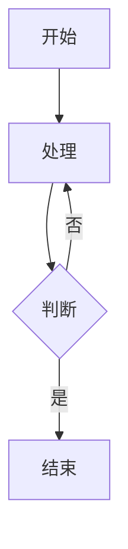

<div align = center>
  
  <h1>astro-theme-reimu</h1>
  
  
  

💘 博麗 霊夢 💘

[演示网站](https://d-sketon.github.io/astro-theme-reimu)

简体中文 | [English](https://github.com/D-Sketon/astro-theme-reimu/blob/main/README.en.md)


</div>

---

本主题是 [hexo-theme-reimu](https://github.com/D-Sketon/hexo-theme-reimu) 的 Astro 移植版本，一款博丽灵梦风格的 Astro 主题。

| framework                    | repository                                                         | version                                                                                                                                                                                     | stars                                                                                              |
| ---------------------------- | ------------------------------------------------------------------ | ------------------------------------------------------------------------------------------------------------------------------------------------------------------------------------------- | -------------------------------------------------------------------------------------------------- |
| [Hexo](https://hexo.io/)     | [hexo-theme-reimu](https://github.com/D-Sketon/hexo-theme-reimu)   |   |   |
| [Hugo](https://gohugo.io)    | [hugo-theme-reimu](https://github.com/D-Sketon/hugo-theme-reimu)   |   |   |
| [Astro](https://astro.build) | [astro-theme-reimu](https://github.com/D-Sketon/astro-theme-reimu) |  |  |

**欢迎提交 ISSUE 和 PR！**

## Lighthouse

<p align="center">
  <a href="https://pagespeed.web.dev/analysis/https-d-sketon-github-io-astro-theme-reimu/ur4yncrgnm?form_factor=desktop">
    
  <a>
</p>

## 特性

### 基础功能

- ✨ 完整的博客功能
- 📱 响应式布局
- 🌙 暗黑模式支持

### 代码与数学

- 🖥️ 代码高亮（基于 Expressive Code）
- ➗ KaTeX 数学公式支持
- 📊 Mermaid 流程图支持

### 搜索与评论

- 🔍 本地搜索（基于 Fuse.js）
- 💬 多评论系统支持：
  - Valine
  - Waline
  - Gitalk

### 统计与分析

- 📊 文章阅读统计（Waline/Valine）
- 👥 访客统计（不蒜子）
- 📈 网站分析：
  - 百度统计
  - Google Analytics
  - Clarity

### 媒体与交互功能

- 🖼️ 图片懒加载（lozad）
- 🖼️ 图片灯箱（baguetteBox）
- ⚡ 加载动画
- 🎨 AOS 滚动动画

### 导航与结构

- 📑 目录导航
- 📰 RSS 订阅

### 设计与自定义

- 🎨 图标支持（FontAwesome、Iconify）
- ©️ 文章版权声明
- 🌐 响应式头图（srcset）

## 安装与使用

### 快速开始

```bash
# 克隆仓库
git clone https://github.com/D-Sketon/astro-theme-reimu.git
cd astro-theme-reimu

# 安装依赖（推荐使用 pnpm）
pnpm install
# 或者使用 npm
npm install

# 启动开发服务器
pnpm run dev
# 或者
npm run dev

# 构建生产版本
pnpm run build
# 或者
npm run build

# 预览构建结果
pnpm run preview
# 或者
npm run preview
```

### 项目结构

```txt
/
├── public/              # 静态资源
│   ├── images/
│   │   ├── banner.webp
│   │   ├── banner-800w.webp
│   │   ├── banner-600w.webp
│   │   ├── favicon.ico
│   │   ├── reimu.png
│   │   └── taichi.png
│   └── robots.txt
├── src/
│   ├── components/      # Astro/React 组件
│   ├── content/         # 内容集合
│   │   ├── blog/        # 博客文章
│   │   └── config.ts    # 内容集合配置
│   ├── hooks/           # React Hooks
│   ├── languages/       # i18n 语言文件
│   │   ├── en.yml
│   │   ├── zh-cn.yml
│   │   ├── zh-tw.yml
│   │   └── ja.yml
│   ├── layouts/         # 页面布局
│   ├── pages/           # 页面路由
│   │   ├── about.mdx    # 关于页面
│   │   ├── archives/    # 归档页面
│   │   ├── blog/        # 博客页面
│   │   ├── categories/  # 分类页面
│   │   ├── tags/        # 标签页面
│   │   └── rss.xml.js   # RSS 订阅
│   ├── plugins/         # Markdown 插件
│   ├── styles/          # 样式文件
│   ├── utils/           # 工具函数
│   ├── config.yml       # 主题配置文件
│   ├── covers.yml       # 封面图配置
│   └── env.d.ts
├── astro.config.mjs     # Astro 配置
├── package.json
└── tsconfig.json
```

任何静态资产（如图像）都可以放置在 `public/` 目录中。  
所有博客文章都存储在目录 `src/content/blog` 中，关于页面存储在目录 `src/pages` 中。

## 配置

### 基本配置

编辑 `src/config.yml` 进行主题配置：

<details>
<summary>站点信息</summary>

```yaml
site:
  title: My Blog              # 站点标题
  subtitle: My Blog Subtitle  # 站点副标题
  description: Your blog description  # 站点描述
  keywords: blog, astro, theme  # 关键词
  author: Your Name           # 作者名称
  language: zh-CN             # 站点语言 (en | zh-CN | zh-TW | ja)
```

</details>

<details>
<summary>侧边栏</summary>

```yaml
sidebar:
  avatar: /images/avatar.webp  # 头像路径（相对于 public 目录）
  position: right              # 侧边栏位置 (left | right)
```

</details>

<details>
<summary>菜单导航</summary>

```yaml
menu:
  - name: home        # 菜单项名称（对应 i18n 翻译）
    url: /            # 链接地址
  - name: archives
    url: /archives
  - name: about
    url: /about
```

</details>

<details>
<summary>头图与封面</summary>

#### 头图配置

```yaml
banner: "/images/banner.webp"  # 头图路径

# 响应式头图（可选）
banner_srcset:
  enable: true
  srcset:
    - src: "/images/banner-600w.webp"
      media: "(max-width: 479px)"
    - src: "/images/banner-800w.webp"
      media: "(max-width: 799px)"
    - src: "/images/banner.webp"
      media: "(min-width: 800px)"
```

#### 封面配置

在 `src/covers.yml` 中配置随机封面图列表：

```yaml
- https://example.com/cover1.webp
- https://example.com/cover2.webp
- https://example.com/cover3.webp
```

文章封面显示逻辑：
1. 如果文章 Front Matter 中指定了 `cover`，则使用指定的封面
2. 否则从 `covers.yml` 中随机选择一张
3. 如果 `covers.yml` 为空，则使用头图作为封面

</details>

<details>
<summary>页脚</summary>

```yaml
footer:
  since: 2020      # 起始年份（会显示为 2020 - 当前年份）
  powered: true    # 是否显示 "Powered by Astro"
  count: true      # 是否显示文章统计
  busuanzi: true   # 是否启用不蒜子访客统计
```

</details>

<details>
<summary>社交链接</summary>

```yaml
social:
  email: mailto:your@email.com
  github: https://github.com/yourname
  twitter: https://twitter.com/yourname
  facebook: https://www.facebook.com/yourname
  # 更多社交平台...
```

</details>

### 评论系统

<details>
<summary>Waline</summary>

[Waline](https://waline.js.org/) 是一个简洁、安全的评论系统。

```yaml
waline:
  enable: true
  serverURL: your-server-url  # Waline 服务器地址
  lang: zh-CN                 # 语言
  locale: {}                  # 自定义语言包
  emoji:                      # 表情包
    - https://unpkg.com/@waline/emojis@1.2.0/weibo
    - https://unpkg.com/@waline/emojis@1.2.0/bilibili
  meta:                       # 评论者信息
    - nick
    - mail
    - link
  requiredMeta:               # 必填项
    - nick
    - mail
  wordLimit: 0                # 评论字数限制（0 为不限制）
  pageSize: 10                # 每页评论数
  pageview: true              # 是否启用浏览量统计
```

</details>

<details>
<summary>Valine</summary>

[Valine](https://valine.js.org/) 是一个基于 LeanCloud 的快速、简洁且高效的无后端评论系统。

```yaml
valine:
  enable: true
  appId: your-app-id          # LeanCloud App ID
  appKey: your-app-key        # LeanCloud App Key
  pageSize: 10                # 评论列表分页
  avatar: mp                  # Gravatar 头像风格
  lang: zh-cn                 # 语言
  placeholder: Just go go     # 评论框占位文本
  guest_info: nick,mail,link  # 评论者信息字段
  recordIP: true              # 是否记录评论者 IP
  highlight: true             # 是否高亮代码块
  visitor: false              # 是否显示访问量
  serverURLs:                 # LeanCloud 服务器地址（可选）
```

</details>

<details>
<summary>Gitalk</summary>

[Gitalk](https://gitalk.github.io/) 是一个基于 GitHub Issue 和 Preact 的现代评论组件。

```yaml
gitalk:
  enable: true
  clientID: your-client-id        # GitHub Application Client ID
  clientSecret: your-client-secret # GitHub Application Client Secret
  repo: your-repo                 # 存储评论的 GitHub 仓库
  owner: your-name                # 仓库所有者
  admin: your-name                # 仓库管理员（可以是数组）
```

</details>

### 分析与统计

<details>
<summary>网站分析</summary>

```yaml
analytics:
  baidu_analytics: your-baidu-id    # 百度统计 ID
  google_analytics: your-ga-id      # Google Analytics ID
  clarity: your-clarity-id          # Microsoft Clarity ID
```

</details>

### 其他功能

<details>
<summary>版权声明</summary>

```yaml
copyright:
  enable: true      # 是否启用版权声明
  content:
    author: true    # 显示作者
    link: true      # 显示文章链接
    title: true     # 显示文章标题
    date: false     # 显示发布日期
    updated: false  # 显示更新日期
    license: true   # 显示许可协议
```

</details>

<details>
<summary>加载动画</summary>

```yaml
preloader:
  enable: true              # 是否启用加载动画
  text: 少女祈祷中...        # 加载文本
  rotate: true              # 图标是否旋转
```

</details>

<details>
<summary>友链</summary>

```yaml
friend:
  - name: Friend Name       # 友链名称
    url: https://friend.com # 友链地址
    desc: Description       # 友链描述
    avatar: /avatar.webp    # 友链头像
```

</details>

## 写作

### 创建文章

在 `src/content/blog/` 目录下创建 `.md` 或 `.mdx` 文件：

```markdown
---
title: 你的文章标题
description: 文章描述
pubDate: 2024-01-01
updatedDate: 2024-01-02
cover: https://example.com/cover.jpg
tags:
  - tag1
  - tag2
categories:
  - category1
---

你的文章内容...
```

### Front Matter 字段

| 字段        | 描述                   | 类型               | 必填 | 默认值 |
| ----------- | ---------------------- | ------------------ | ---- | ------ |
| title       | 文章标题               | string             | 是   | -      |
| description | 文章描述（用于 SEO）   | string             | 否   | -      |
| keywords    | 文章关键词（用于 SEO） | string[] \| string | 否   | []     |
| pubDate     | 发布日期               | Date               | 是   | -      |
| updatedDate | 更新日期               | Date               | 否   | -      |
| cover       | 封面图 URL             | string             | 否   | -      |
| tags        | 标签列表               | string[]           | 否   | []     |
| categories  | 分类列表               | string[]           | 否   | []     |
| excerpt     | 文章摘要               | string             | 否   | -      |
| comment     | 是否启用评论系统       | boolean            | 否   | true   |

### 数学公式

主题内置了 KaTeX 支持，可以直接在 Markdown 中使用 LaTeX 语法：

```markdown
行内公式：$E = mc^2$

块级公式：

$$
\frac{n!}{k!(n-k)!} = \binom{n}{k}
$$
```

### Mermaid 流程图

主题内置了 Mermaid 支持：

````markdown

````

### 代码块

代码块基于 [Expressive Code](https://expressive-code.com/) 实现，支持：

- 语法高亮
- 行号显示
- 代码折叠（使用 `collapse` 标记）
- 代码复制按钮

示例：

````markdown
```js collapse={1-5, 12-14}
// 这些行默认折叠
function example() {
  console.log("Hello");
}

// 这些行默认展开
const result = example();
```
````

## 部署

### 配置站点信息

编辑 `astro.config.mjs`：

```javascript
export default defineConfig({
  site: 'https://yourusername.github.io',  // 你的站点 URL
  base: 'your-repo-name',                  // 子路径（如部署到 GitHub Pages）
  // ...
});
```

### GitHub Pages

1. 构建项目：

```bash
pnpm run build
```

2. 将 `dist/` 目录部署到 GitHub Pages

或者配置 GitHub Actions 自动部署（推荐），具体可参考 [Github Pages](https://docs.astro.build/zh-cn/guides/deploy/github/)。

### Vercel / Netlify

这些平台会自动识别 Astro 项目：

1. 连接 GitHub 仓库
2. 平台会自动检测并使用正确的构建命令
3. 点击部署即可，具体请参考 [Netlify](https://docs.astro.build/zh-cn/guides/deploy/netlify/) 或 [Netlify](https://docs.astro.build/zh-cn/guides/deploy/vercel/) 文档。

## 开发

### 添加新页面

在 `src/pages/` 目录下创建文件即可，Astro 会自动处理路由。

### 修改样式

样式文件位于 `src/styles/` 目录：

- `base.stylus` - 基础样式
- `global.css` - 全局样式
- `markdown.stylus` - Markdown 渲染样式
- 其他样式文件...

### i18n

语言文件位于 `src/languages/` 目录，支持的语言：

- `en.yml` - English
- `zh-cn.yml` - 简体中文
- `zh-tw.yml` - 繁体中文
- `ja.yml` - 日本語

要添加新语言，创建对应的 `.yml` 文件并参考现有文件的结构。

## 贡献者

[](https://github.com/D-Sketon/astro-theme-reimu/graphs/contributors)

## 赞助 💘

[爱发电-afdian](https://afdian.tv/a/dsketon)

## Star History

[](https://www.star-history.com/#D-Sketon/astro-theme-reimu&type=date&legend=top-left)

## 许可

MIT

[](https://app.fossa.com/projects/git%2Bgithub.com%2FD-Sketon%2Fastro-theme-reimu?ref=badge_large)
 