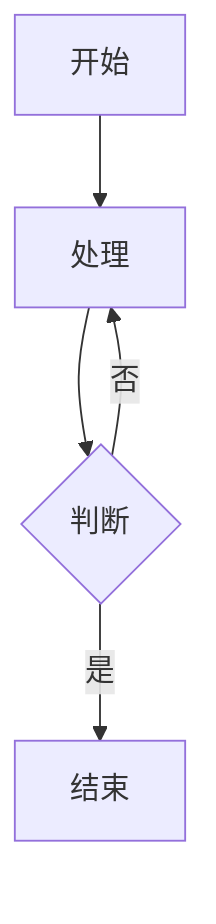

<div align = center>
  
  <h1>astro-theme-reimu</h1>
  
  
  

💘 博麗 霊夢 💘

[演示网站](https://d-sketon.github.io/astro-theme-reimu)

简体中文 | [English](https://github.com/D-Sketon/astro-theme-reimu/blob/main/README.en.md)


</div>

---

本主题是 [hexo-theme-reimu](https://github.com/D-Sketon/hexo-theme-reimu) 的 Astro 移植版本，一款博丽灵梦风格的 Astro 主题。

| framework                    | repository                                                         | version                                                                                                                                                                                     | stars                                                                                              |
| ---------------------------- | ------------------------------------------------------------------ | ------------------------------------------------------------------------------------------------------------------------------------------------------------------------------------------- | -------------------------------------------------------------------------------------------------- |
| [Hexo](https://hexo.io/)     | [hexo-theme-reimu](https://github.com/D-Sketon/hexo-theme-reimu)   |   |   |
| [Hugo](https://gohugo.io)    | [hugo-theme-reimu](https://github.com/D-Sketon/hugo-theme-reimu)   |   |   |
| [Astro](https://astro.build) | [astro-theme-reimu](https://github.com/D-Sketon/astro-theme-reimu) |  |  |

**欢迎提交 ISSUE 和 PR！**

## Lighthouse

<p align="center">
  <a href="https://pagespeed.web.dev/analysis/https-d-sketon-github-io-astro-theme-reimu/ur4yncrgnm?form_factor=desktop">
    
  </a>
</p>

## 特性

### 基础功能

- ✨ 完整的博客功能
- 📱 响应式布局
- 🌙 暗黑模式支持
- 🌍 多语言支持（i18n）

### 代码与数学

- 🖥️ 代码高亮（基于 Expressive Code）
- ➗ KaTeX 数学公式支持
- 📊 Mermaid 流程图支持

### 搜索与评论

- 🔍 本地搜索（基于 Fuse.js）
- 💬 多评论系统支持：
  - Valine
  - Waline
  - Twikoo
  - Gitalk
  - Giscus
  - Disqus
  - Utterances

### 统计与分析

- 📊 文章阅读统计（Waline/Valine）
- 👥 访客统计（不蒜子）
- 📈 网站分析：
  - 百度统计
  - Google Analytics
  - Clarity

### 媒体与交互功能

- 🖼️ 图片懒加载
- 🖼️ 图片灯箱
- ⚡ 加载动画
- 🎨 AOS 滚动动画
- 🎯 鼠标特效

### 导航与结构

- 📑 目录导航
- 📰 RSS 订阅

### 设计与自定义

- 🎨 图标支持（FontAwesome、Iconify）
- 🔗 内置 mdx 组件：
  - 内部链接
  - 外部链接
  - 友情链接
  - 热力图
  - 标签轮盘
  - 标签页
  - 照片墙
- ©️ 文章版权声明
- 🌐 响应式头图（srcset）
- 🎨 分享卡片功能

## 安装与使用

### 快速开始

```bash
# 克隆仓库
git clone https://github.com/D-Sketon/astro-theme-reimu.git
cd astro-theme-reimu

# 安装依赖（推荐使用 pnpm）
pnpm install

# 启动开发服务器
pnpm run dev

# 构建生产版本
pnpm run build

# 预览构建结果
pnpm run preview
```

### 项目结构

```plain
/
├── public/              # 静态资源
│   ├── images/
│   │   ├── banner.webp
│   │   ├── banner-800w.webp
│   │   ├── banner-600w.webp
│   │   ├── favicon.ico
│   │   ├── reimu.png
│   │   └── taichi.png
│   └── robots.txt
├── src/
│   ├── components/      # Astro/React 组件
│   ├── content/         # 内容集合
│   │   ├── blog/        # 博客文章
│   │   └── config.ts    # 内容集合配置
│   ├── hooks/           # React Hooks
│   ├── languages/       # i18n 语言文件
│   │   ├── en.ts
│   │   ├── zh-cn.ts
│   │   ├── zh-tw.ts
│   │   └── ja.ts
│   ├── layouts/         # 页面布局
│   ├── pages/           # 页面路由
│   │   ├── about.mdx    # 关于页面
│   │   ├── archives/    # 归档页面
│   │   ├── blog/        # 博客页面
│   │   ├── categories/  # 分类页面
│   │   ├── tags/        # 标签页面
│   │   └── rss.xml.js   # RSS 订阅
│   ├── plugins/         # Markdown 插件
│   ├── styles/          # 样式文件
│   ├── utils/           # 工具函数
│   ├── config.ts        # 主题配置文件
│   ├── covers.ts        # 封面图配置
│   └── env.d.ts
├── astro.config.mjs     # Astro 配置
├── package.json
└── tsconfig.json
```

任何静态资产（如图像）都可以放置在 `public/` 目录中。  
所有博客文章都存储在目录 `src/content/blog` 中，关于页面存储在目录 `src/pages` 中。

## 配置

编辑 `src/config.ts` 进行主题配置：

<details>
<summary>基本配置</summary>

##### 站点信息

```typescript
export default {
  site: {
    title: "My Blog", // 站点标题
    subtitle: "My Blog Subtitle", // 站点副标题
    description: "Your blog description", // 站点描述
    keywords: "blog, astro, theme", // 关键词
    author: "Your Name", // 作者名称
    language: "zh-CN", // 站点语言 (en | zh-CN | zh-TW | ja)
  },
};
```

##### 侧边栏

```typescript
export default {
  sidebar: {
    avatar: "/images/avatar.webp", // 头像路径（相对于 public 目录）
    position: "right", // 侧边栏位置 (left | right)
  },
};
```

##### 侧边栏小部件

```typescript
export default {
  widgets: [
    "category", // 分类
    "tag", // 标签
    "tagcloud", // 标签云
    "archive", // 归档
    "recent_posts", // 最近文章
  ],
};
```

##### 菜单导航

```typescript
export default {
  menu: [
    { name: "home", url: "/" }, // 菜单项名称（对应 i18n 翻译）
    { name: "archives", url: "/archives" },
    { name: "about", url: "/about" },
  ],
};
```

##### 头图与封面

###### 头图配置

```typescript
export default {
  banner: "/images/banner.webp", // 头图路径

  // 响应式头图（可选）
  banner_srcset: {
    enable: true,
    srcset: [
      { src: "/images/banner-600w.webp", media: "(max-width: 479px)" },
      { src: "/images/banner-800w.webp", media: "(max-width: 799px)" },
      { src: "/images/banner.webp", media: "(min-width: 800px)" },
    ],
  },
};
```

###### 封面配置

在 `src/covers.ts` 中配置随机封面图列表：

```typescript
export default [
  "https://example.com/cover1.webp",
  "https://example.com/cover2.webp",
  "https://example.com/cover3.webp",
];
```

文章封面显示逻辑：

1. 如果文章 Front Matter 中指定了 `cover`，则使用指定的封面
2. 否则从 `covers.ts` 中随机选择一张
3. 如果 `covers.ts` 为空，则使用头图作为封面

##### 页脚

```typescript
export default {
  footer: {
    since: 2020, // 起始年份（会显示为 2020 - 当前年份）
    powered: true, // 是否显示 "Powered by Astro"
    count: true, // 是否显示文章统计
    busuanzi: true, // 是否启用不蒜子访客统计
    icp: {
      icpnumber: "", // ICP备案号
      beian: "", // 网安备案号
      recordcode: "", // 网安备案链接中的recordcode参数
    },
    moe_icp: {
      icpnumber: "", // 萌国ICP备案号
    },
  },
};
```

##### 社交链接

```typescript
export default {
  social: {
    email: "mailto:your@email.com",
    github: "https://github.com/yourname",
    twitter: "https://twitter.com/yourname",
    facebook: "https://www.facebook.com/yourname",
    // 更多社交平台...
  },
};
```

</details>

<details>
<summary>评论系统</summary>

##### Waline

[Waline](https://waline.js.org/) 是一个简洁、安全的评论系统。

```typescript
export default {
  waline: {
    enable: true,
    serverURL: "your-server-url", // Waline 服务器地址
    lang: "zh-CN", // 语言
    locale: {}, // 自定义语言包
    emoji: [
      // 表情包
      "https://unpkg.com/@waline/emojis@1.2.0/weibo",
      "https://unpkg.com/@waline/emojis@1.2.0/bilibili",
    ],
    meta: ["nick", "mail", "link"], // 评论者信息
    requiredMeta: ["nick", "mail"], // 必填项
    wordLimit: 0, // 评论字数限制（0 为不限制）
    pageSize: 10, // 每页评论数
    pageview: true, // 是否启用浏览量统计
  },
};
```

##### Valine

[Valine](https://valine.js.org/) 是一个基于 LeanCloud 的快速、简洁且高效的无后端评论系统。

```typescript
export default {
  valine: {
    enable: true,
    appId: "your-app-id", // LeanCloud App ID
    appKey: "your-app-key", // LeanCloud App Key
    pageSize: 10, // 评论列表分页
    avatar: "mp", // Gravatar 头像风格
    lang: "zh-cn", // 语言
    placeholder: "Just go go", // 评论框占位文本
    guest_info: "nick,mail,link", // 评论者信息字段
    recordIP: true, // 是否记录评论者 IP
    highlight: true, // 是否高亮代码块
    visitor: false, // 是否显示访问量
    serverURLs: "", // LeanCloud 服务器地址（可选）
  },
};
```

##### Gitalk

[Gitalk](https://gitalk.github.io/) 是一个基于 GitHub Issue 和 Preact 的现代评论组件。

```typescript
export default {
  gitalk: {
    enable: true,
    clientID: "your-client-id", // GitHub Application Client ID
    clientSecret: "your-client-secret", // GitHub Application Client Secret
    repo: "your-repo", // 存储评论的 GitHub 仓库
    owner: "your-name", // 仓库所有者
    admin: ["your-name"], // 仓库管理员（可以是数组）
  },
};
```

##### Giscus

[Giscus](https://giscus.app/zh-CN) 是一个基于 GitHub Discussion 的评论系统。

```typescript
export default {
  giscus: {
    enable: true,
    repo: "your-username/your-repo", // GitHub 仓库
    repoId: "your-repo-id", // 仓库 ID
    category: "your-category", // 分类名称
    categoryId: "your-category-id", // 分类 ID
    mapping: "pathname", // 评论映射方式
    strict: 0, // 严格模式
    reactionsEnabled: 1, // 启用反应
    emitMetadata: 0, // 发出元数据
    inputPosition: "bottom", // 输入框位置
  },
};
```

##### Twikoo

[Twikoo](https://twikoo.js.org/) 支持多种部署方式的评论系统。

```typescript
export default {
  twikoo: {
    enable: true,
    envId: "your-env-id", // 腾讯云环境填 envId；Vercel 环境填地址（https://xxx.vercel.app）
    region: "", // 腾讯云区域（可选）
  },
};
```

##### Utterances

[Utterances](https://utteranc.es/) 是一个基于 GitHub Issue 的轻量级评论组件。

```typescript
export default {
  utterances: {
    enable: true,
    repo: "owner/repo", // GitHub 仓库
    issue_term: "title", // Issue 映射方式
    theme: "github-light", // 主题
  },
};
```

##### Disqus

[Disqus](https://disqus.com/) 是一个全球性的评论系统。

```typescript
export default {
  disqus: {
    enable: true,
    shortname: "your-shortname", // Disqus shortname
    count: true, // 是否启用评论数量统计
  },
};
```

</details>

<details>
<summary>分析与统计</summary>

##### 网站分析

```typescript
export default {
  analytics: {
    baidu_analytics: "your-baidu-id", // 百度统计 ID
    google_analytics: "your-ga-id", // Google Analytics ID
    clarity: "your-clarity-id", // Microsoft Clarity ID
  },
};
```

</details>

<details>
<summary>其他功能</summary>

##### 版权声明

```typescript
export default {
  copyright: {
    enable: true, // 是否启用版权声明
    content: {
      author: true, // 显示作者
      link: true, // 显示文章链接
      title: true, // 显示文章标题
      date: false, // 显示发布日期
      updated: false, // 显示更新日期
      license: true, // 显示许可协议
      license_type: "by-nc-sa", // 许可协议类型
    },
  },
};
```

##### 加载动画

```typescript
export default {
  preloader: {
    enable: true, // 是否启用加载动画
    text: "少女祈祷中...", // 加载文本
    rotate: true, // 图标是否旋转
  },
};
```

##### 友链

```typescript
export default {
  friend: [
    {
      name: "Friend Name", // 友链名称
      url: "https://friend.com", // 友链地址
      desc: "Description", // 友链描述
      avatar: "/avatar.webp", // 友链头像
    },
  ],
};
```

##### 首页分类卡片

```typescript
export default {
  home_categories: {
    enable: true, // 是否启用首页分类卡片
    content: [
      {
        categories: "Blog", // 分类名称
        cover: "/images/category-cover.webp", // 分类封面（可选）
      },
    ],
  },
};
```

##### 分享功能

```typescript
export default {
  share: [
    "weibo", // 微博
    "qq", // QQ
    "weixin", // 微信
    // "twitter",  // Twitter
    // "facebook", // Facebook
    // "linkedin", // LinkedIn
    // "reddit",   // Reddit
  ],
};
```

##### 赞助功能

```typescript
export default {
  sponsor: {
    enable: false, // 是否启用赞助功能
    qr: [
      { name: "支付宝", src: "/sponsor/alipay.jpg" },
      { name: "微信", src: "/sponsor/wechat.png" },
    ],
  },
};
```

##### 文章过期提醒

```typescript
export default {
  outdate: {
    enable: false, // 是否启用文章过期提醒
    daysAgo: 180, // 多少天前的文章算过期
  },
};
```

##### 鼠标特效

```typescript
export default {
  firework: {
    enable: true, // 是否启用鼠标特效
    disable_on_mobile: false, // 是否在移动端禁用
    options: {
      // 详细配置请参考 mouse-firework 文档
    },
  },
};
```

##### 三角徽标

```typescript
export default {
  triangle_badge: {
    enable: false,
    type: "github", // 图标类型
    link: "https://github.com/yourname",
  },
};
```

</details>

## 写作

<details>
<summary>创建文章</summary>

在 `src/content/blog/` 目录下创建 `.md` 或 `.mdx` 文件：

```markdown
---
title: 你的文章标题
description: 文章描述
pubDate: 2024-01-01
updatedDate: 2024-01-02
cover: https://example.com/cover.jpg
tags:
  - tag1
  - tag2
categories:
  - category1
---

你的文章内容...
```

</details>

<details>
<summary>Front Matter 字段</summary>

#### Front Matter 字段

| 字段        | 描述                   | 类型                 | 必填 | 默认值  |
| ----------- | ---------------------- | -------------------- | ---- | ------- |
| title       | 文章标题               | `string`             | 是   | -       |
| description | 文章描述（用于 SEO）   | `string`             | 是   | -       |
| keywords    | 文章关键词（用于 SEO） | `string[] \| string` | 否   | `[]`    |
| pubDate     | 发布日期               | `Date`               | 是   | -       |
| updatedDate | 更新日期               | `Date`               | 否   | -       |
| cover       | 封面图 URL             | `string`             | 否   | -       |
| tags        | 标签列表               | `string[]`           | 否   | `[]`    |
| categories  | 分类列表               | `string[]`           | 否   | `[]`    |
| excerpt     | 文章摘要               | `string`             | 否   | -       |
| comment     | 是否启用评论系统       | `boolean`            | 否   | `true`  |
| author      | 文章作者               | `string`             | 否   | -       |
| toc         | 是否显示目录           | `boolean`            | 否   | `true`  |
| sponsor     | 是否显示赞助信息       | `boolean`            | 否   | -       |
| copyright   | 是否显示版权声明       | `boolean`            | 否   | -       |
| share       | 是否显示分享按钮       | `boolean`            | 否   | -       |
| outdated    | 文章是否过期           | `boolean`            | 否   | `false` |

</details>

<details>
<summary>数学公式</summary>

主题内置了 KaTeX 支持，可以直接在 Markdown 中使用 LaTeX 语法：

#### 行内公式

```markdown
行内公式：$E = mc^2$
```

#### 块级公式

```markdown
块级公式：

$$
\frac{n!}{k!(n-k)!} = \binom{n}{k}
$$
```

</details>

<details>
<summary>Mermaid 流程图</summary>

主题内置了 Mermaid 支持：

````markdown

````

</details>

<details>
<summary>代码块</summary>

代码块基于 [Expressive Code](https://expressive-code.com/) 实现，支持：

- 语法高亮
- 行号显示
- 代码折叠（使用 `collapse` 标记）
- 代码复制按钮

#### 基本代码块

````markdown
```javascript
function hello() {
  console.log("Hello, World!");
}
```
````

#### 代码折叠

````markdown
```js collapse={1-5, 12-14}
// 这些行默认折叠
function example() {
  console.log("Hello");
}

// 这些行默认展开
const result = example();
```
````

</details>

<details>
<summary>内置组件</summary>

主题提供了丰富的内置 MDX 组件：

#### 链接组件

##### 内部链接

用于在文章中创建指向其他文章的精美链接卡片，支持显示封面图和摘要。适合在文章中推荐相关内容或创建内容导航。

```markdown
<Link slug="post-slug" title="文章标题" cover="封面URL" />
```

**Props:**

- `slug` (`string`, 可选): 文章 slug
- `url` (`string`, 可选): 外部链接 URL
- `title` (`string`, 可选): 链接标题
- `cover` (`string | "auto"`, 可选): 封面图片

##### 外部链接

用于创建指向外部网站的精美链接卡片，自动识别为外部链接。适合在文章中分享外部资源或推荐其他网站。

```markdown
<Link url="https://github.com" title="GitHub" cover="auto" />
```

#### 内容组件

##### 友情链接卡片

展示友情链接列表，每个链接包含头像、名称和描述。适合在关于页面或专门的友链页面展示合作伙伴网站。

友情链接卡片使用全局配置中的友链列表：

```markdown
<FriendCard />
```

**Props:** 无

##### 热力图卡片

基于访问量数据生成热力图可视化，展示内容活跃度。适合在个人主页或数据统计页面展示访问数据。

```markdown
<HeatMapCard levelStandard="1000,5000,10000" />
```

**Props:**

- `levelStandard` (`string`, 可选): 等级标准，默认 "1000,5000,10000"

##### 标签轮盘

以轮盘形式展示标签列表，用户可以点击随机选择标签。适合在标签页面或侧边栏增加趣味性交互。

```markdown
<TagRoulette tags="标签1,标签2,标签3" icon="🎯" />
```

**Props:**

- `tags` (`string`, 可选): 标签列表，用逗号分隔，默认预设标签
- `icon` (`string`, 可选): 按钮图标，默认 "🕹️"

#### 布局组件

##### 标签页

创建多标签页界面，可以在同一区域展示不同内容。适合展示相关内容的多个方面或选项卡式导航。

```markdown
<Tabs active={1} center={false}>
  <TabItem title="Tab 1">内容1</TabItem>
  <TabItem title="Tab 2">内容2</TabItem>
</Tabs>
```

**Tabs Props:**

- `active` (`number`, 可选): 默认激活的标签页，默认 1
- `center` (`boolean`, 可选): 是否居中，默认 false

**TabItem Props:**

- `title` (`string`, 必需): 标签页标题

##### 折叠详情

创建可展开/折叠的内容区域，可以隐藏次要信息。适合展示详细说明、代码示例或长文本内容。

```markdown
<Details summary="点击展开">
  这里是折叠的内容
</Details>
```

**Props:**

- `summary` (`string`, 必需): 折叠标题

##### 网格布局

创建响应式网格布局，可以灵活排列内容。适合展示卡片列表、图片网格或等宽内容块。

```markdown
<Grid col={3}>
  <GridCell>单元格1</GridCell>
  <GridCell>单元格2</GridCell>
  <GridCell>单元格3</GridCell>
</Grid>
```

**Grid Props:**

- `width` (`number`, 可选): 最小宽度，默认 240
- `col` (`number`, 可选): 列数，优先于 width

**GridCell Props:** 无

##### 照片墙

创建精美的图片展示墙，支持灯箱效果。适合在文章中展示多张图片或创建图片集页面。

```markdown
<Gallery>
  
  
</Gallery>
```

**Props:** 无

##### 警告块

创建不同类型的提示信息框，支持多种样式。适合突出重要信息、警告或提示用户注意。

```markdown
<AlertBlockquote type="info" title="提示">
  这是一个信息提示
</AlertBlockquote>

<AlertBlockquote type="warning">
  这是一个警告提示
</AlertBlockquote>

<AlertBlockquote type="danger">
  这是一个危险提示
</AlertBlockquote>
```

**Props:**

- `type` (`"info" | "warning" | "danger" | "tip" | "important"`, 可选): 警告类型，默认 "info"
- `title` (`string`, 可选): 自定义标题，默认使用 type 大写

</details>

## 部署

### 配置站点信息

编辑 `astro.config.mjs`：

```javascript
export default defineConfig({
  site: "https://yourusername.github.io", // 你的站点 URL
  base: "your-repo-name", // 子路径（如部署到 GitHub Pages）
  // ...
});
```

### GitHub Pages

1. 构建项目：

```bash
pnpm run build
```

2. 将 `dist/` 目录部署到 GitHub Pages

或者配置 GitHub Actions 自动部署（推荐），具体可参考 [Github Pages](https://docs.astro.build/zh-cn/guides/deploy/github/)。

### Vercel / Netlify

这些平台会自动识别 Astro 项目：

1. 连接 GitHub 仓库
2. 平台会自动检测并使用正确的构建命令
3. 点击部署即可，具体请参考 [Netlify](https://docs.astro.build/zh-cn/guides/deploy/netlify/) 或 [Vercel](https://docs.astro.build/zh-cn/guides/deploy/vercel/) 文档。

## 开发

### 添加新页面

在 `src/pages/` 目录下创建文件即可，Astro 会自动处理路由。

### 修改样式

样式文件位于 `src/styles/` 目录：

- `base.stylus` - 基础样式
- `global.css` - 全局样式
- `markdown.stylus` - Markdown 渲染样式
- 其他样式文件...

### i18n

语言文件位于 `src/languages/` 目录，支持的语言：

- `en.ts` - English
- `zh-cn.ts` - 简体中文
- `zh-tw.ts` - 繁体中文
- `ja.ts` - 日本語

要添加新语言，创建对应的 `.ts` 文件并参考现有文件的结构。

## 贡献者

[](https://github.com/D-Sketon/astro-theme-reimu/graphs/contributors)

## 赞助 💘

[爱发电-afdian](https://afdian.tv/a/dsketon)

## Star History

[](https://www.star-history.com/#D-Sketon/astro-theme-reimu&type=date&legend=top-left)

## 许可

MIT

[](https://app.fossa.com/projects/git%2Bgithub.com%2FD-Sketon%2Fastro-theme-reimu?ref=badge_large)
