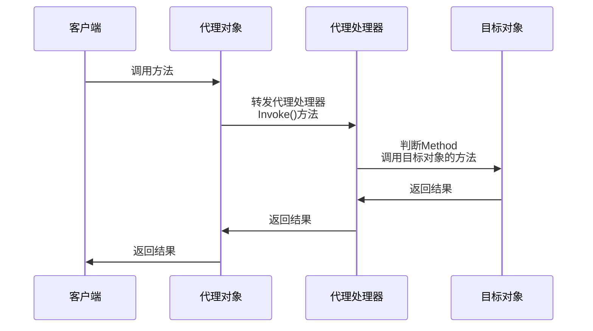
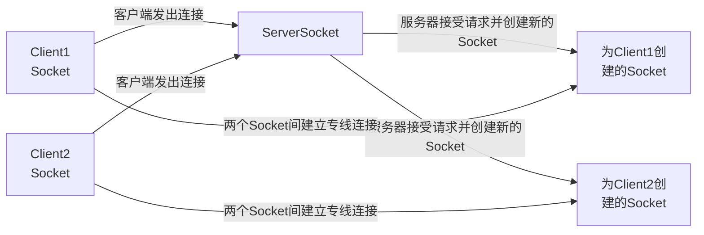

## Markdown 基本元素

### 标题

# H1

## H2

### H3

#### H4

##### H5

###### H6

### 强调

Emphasis, aka italics, with _asterisks_ or _underscores_.

Strong emphasis, aka bold, with **asterisks** or **underscores**.

Combined emphasis with **asterisks and _underscores_**.

Strikethrough uses two tildes. ~~Scratch this.~~

### 列表

#### Definition List (dl)

<dl><dt>Definition List Title</dt><dd>This is a definition list division.</dd></dl>

#### Ordered List (ol)

1. List Item 1
2. List Item 2
3. List Item 3

#### Unordered List (ul)

- List Item 1
- List Item 2
- List Item 3

### 段落

Lorem ipsum dolor sit amet, [test link]() consectetur adipiscing elit. **Strong text** pellentesque ligula commodo viverra vehicula. _Italic text_ at ullamcorper enim. Morbi a euismod nibh. <u>Underline text</u> non elit nisl. ~~Deleted text~~ tristique, sem id condimentum tempus, metus lectus venenatis mauris, sit amet semper lorem felis a eros. Fusce egestas nibh at sagittis auctor. Sed ultricies ac arcu quis molestie. Donec dapibus nunc in nibh egestas, vitae volutpat sem iaculis. Curabitur sem tellus, elementum nec quam id, fermentum laoreet mi. Ut mollis ullamcorper turpis, vitae facilisis velit ultricies sit amet. Etiam laoreet dui odio, id tempus justo tincidunt id. Phasellus scelerisque nunc sed nunc ultricies accumsan.

Interdum et malesuada fames ac ante ipsum primis in faucibus. `Sed erat diam`, blandit eget felis aliquam, rhoncus varius urna. Donec tellus sapien, sodales eget ante vitae, feugiat ullamcorper urna. Praesent auctor dui vitae dapibus eleifend. Proin viverra mollis neque, ut ullamcorper elit posuere eget.

> This is a very long line that will still be quoted properly when it wraps. Oh boy let's keep writing to make sure this is long enough to actually wrap for everyone. Oh, you can _put_ **Markdown** into a blockquote.

Maecenas ornare arcu at mi suscipit, non molestie tortor ultrices. Aenean convallis, diam et congue ultricies, erat magna tincidunt orci, pulvinar posuere mi sapien ac magna. Vestibulum ante ipsum primis in faucibus orci luctus et ultrices posuere cubilia Curae; Praesent vitae placerat mauris. Nullam laoreet ante posuere tortor blandit auctor. Sed id ligula volutpat leo consequat placerat. Mauris fermentum dolor sed augue malesuada sollicitudin. Vivamus ultrices nunc felis, quis viverra orci eleifend ut. Donec et quam id urna cursus posuere. Donec elementum scelerisque laoreet.

### 表格

| Table Header 1 | Table Header 2 | Table Header 3 |
| -------------- | -------------- | -------------- |
| Division 1     | Division 2     | Division 3     |
| Division 1     | Division 2     | Division 3     |
| Division 1     | Division 2     | Division 3     |

| Markdown | Less      | Pretty     |
| -------- | --------- | ---------- |
| _Still_  | `renders` | **nicely** |
| 1        | 2         | 3          |

### 其他元素 - abbr, acronym, sub, sup, kbd, etc.

Lorem <sup>superscript</sup> dolor <sub>subscript</sub> amet, consectetuer adipiscing elit. Nullam dignissim convallis est. Quisque aliquam. <cite>cite</cite>. Nunc iaculis suscipit dui. Nam sit amet sem. Aliquam libero nisi, imperdiet at, tincidunt nec, gravida vehicula, nisl. Praesent mattis, massa quis luctus fermentum, turpis mi volutpat justo, eu volutpat enim diam eget metus. Maecenas ornare tortor. Donec sed tellus eget sapien fringilla nonummy. <acronym title="National Basketball Association">NBA</acronym> Mauris a ante. Suspendisse quam sem, consequat at, commodo vitae, feugiat in, nunc. Morbi imperdiet augue quis tellus. <abbr title="Avenue">AVE</abbr>. Use <kbd>Crtl</kbd> + <kbd>C</kbd> to stop.

### 图片


## 代码块

```plain title="example.txt"
Lorem Ipsum is simply dummy text of the printing and typesetting industry. Lorem Ipsum has been the industry's standard dummy text ever since the 1500s, when an unknown printer took a galley of type and scrambled it to make a type specimen book.
```

```rust title="example.rs"
#[derive(Debug)]
pub enum State {
    Start,
    Transient,
    Closed,
}

impl From<&'a str> for State {
    fn from(s: &'a str) -> Self {
        match s {
            "start" => State::Start,
            "closed" => State::Closed,
            _ => unreachable!(),
        }
    }
}
```

```json title="example.json"
[
  {
    "title": "apples",
    "count": [12000, 20000],
    "description": { "text": "...", "sensitive": false }
  },
  {
    "title": "oranges",
    "count": [17500, null],
    "description": { "text": "...", "sensitive": false }
  }
]
```

```python title="example.py"
@requires_authorization
def somefunc(param1='', param2=0):
    r'''A docstring'''
    if param1 > param2: # interesting
        print 'Gre\'ater'
    return (param2 - param1 + 1 + 0b10l) or None

class SomeClass:
    pass

>>> message = '''interpreter
... prompt'''
```

```html title="example.html"
<!DOCTYPE html>
<title>Title</title>

<style>
  body {
    width: 500px;
  }
</style>

<script type="application/javascript">
  function $init() {
    return true;
  }
</script>

<body>
  <p checked class="title" id="title">Title</p>
  <!-- here goes the rest of the page -->
</body>
```

```javascript title="example.js"
function $initHighlight(block, cls) {
  try {
    if (cls.search(/\bno\-highlight\b/) != -1)
      return process(block, true, 0x0F) +
             ` class="${cls}"`;
  } catch (e) {
    /* handle exception */
  }
  for (var i = 0 / 2; i < classes.length; i++) {
    if (checkCondition(classes[i]) === undefined)
      console.log('undefined');
  }

  return (
    <div>
      <web-component>{block}</web-component>
    </div>
  )
}

export $initHighlight;
```

```cpp title="example.cpp"
#include <iostream>

int main(int argc, char *argv[]) {

  /* An annoying "Hello World" example */
  for (auto i = 0; i < 0xFFFF; i++)
    cout << "Hello, World!" << endl;

  char c = '\n';
  unordered_map <string, vector<string> > m;
  m["key"] = "\\\\"; // this is an error

  return -2e3 + 12l;
}
```

```sql title="example.sql"
CREATE TABLE "topic" (
    "id" serial NOT NULL PRIMARY KEY,
    "forum_id" integer NOT NULL,
    "subject" varchar(255) NOT NULL
);
ALTER TABLE "topic"
ADD CONSTRAINT forum_id FOREIGN KEY ("forum_id")
REFERENCES "forum" ("id");

-- Initials
insert into "topic" ("forum_id", "subject")
values (2, 'D''artagnian');
```

```java title="example.java"
/**
 * @author John Smith <john.smith@example.com>
*/
package l2f.gameserver.model;

public abstract class L2Char extends L2Object {
  public static final Short ERROR = 0x0001;

  public void moveTo(int x, int y, int z) {
    _ai = null;
    log("Should not be called");
    if (1 > 5) { // wtf!?
      return;
    }
  }
}
```

```swift title="example.swift"
import Foundation

@objc class Person: Entity {
  var name: String!
  var age:  Int!

  init(name: String, age: Int) {
    /* /* ... */ */
  }

  // Return a descriptive string for this person
  func description(offset: Int = 0) -> String {
    return "\(name) is \(age + offset) years old"
  }
}
```

```css title="example.css"
@font-face {
  font-family: Chunkfive;
  src: url("Chunkfive.otf");
}

body,
.usertext {
  color: #f0f0f0;
  background: #600;
  font-family: Chunkfive, sans;
}

@import url(print.css);
@media print {
  a[href^="http"]::after {
    content: attr(href);
  }
}
```

```ruby title="example.rb"
# The Greeter class
class Greeter
  def initialize(name)
    @name = name.capitalize
  end

  def salute
    puts "Hello #{@name}!"
  end
end

g = Greeter.new("world")
g.salute
```

```go title="example.go"
package main

import "fmt"

func main() {
    ch := make(chan float64)
    ch <- 1.0e10    // magic number
    x, ok := <- ch
    defer fmt.Println(`exitting now\`)
    go println(len("hello world!"))
    return
}
```

```bash title="example.sh"
#!/bin/bash

###### CONFIG
ACCEPTED_HOSTS="/root/.hag_accepted.conf"
BE_VERBOSE=false

if [ "$UID" -ne 0 ]
then
  echo "Superuser rights required"
  exit 2
fi

genApacheConf(){
  echo -e "# Host ${HOME_DIR}$1/$2 :"
}
```

```ini title="example.ini"
; boilerplate
[package]
name = "some_name"
authors = ["Author"]
description = "This is \
a description"

[[lib]]
name = ${NAME}
default = True
auto = no
counter = 1_000
```

## 数学公式

$f(n) = \Theta(g(n)) \land g(n) = \Theta(h(n)) \rightarrow f(n) = \Theta(h(n))$

$\omega(g(n))=\{f(n):\text{存在正常量}c\text{和}n_0\text{，使得对所有}n \geq n_0\text{，有}0\leq cg(n) < f(n)\}$

$$
f^{(i)}(n) =
\begin{cases}
n \qquad & i = 1 \\
f(f^{(i-1)}(n)) \qquad &  i>1
\end{cases}
$$

$$
A = \begin{bmatrix}
A_{11} & A_{12} \\
A_{21} & A_{22}
\end{bmatrix}
,
B = \begin{bmatrix}
B_{11} & B_{12} \\
B_{21} & B_{22}
\end{bmatrix}
,
C = \begin{bmatrix}
C_{11} & C_{12} \\
C_{21} & C_{22}
\end{bmatrix}
$$

$$\sum^{\lfloor lgn \rfloor}_{h=0} \lceil \frac{n}{2^{h+1}} \rceil O(h) = O(n \sum^{\lfloor lgn \rfloor}_{h=0} \frac{h}{2^h}) =  O(n \sum^{\infty}_{h=0} \frac{h}{2^h}) =O(n)$$

## 流程图



