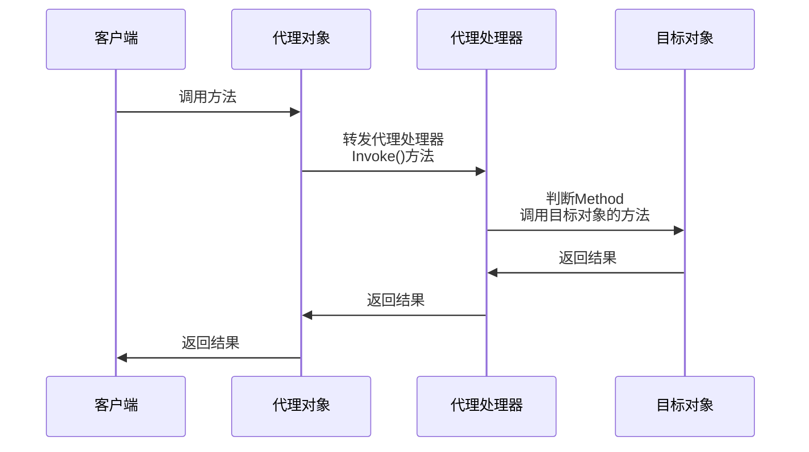
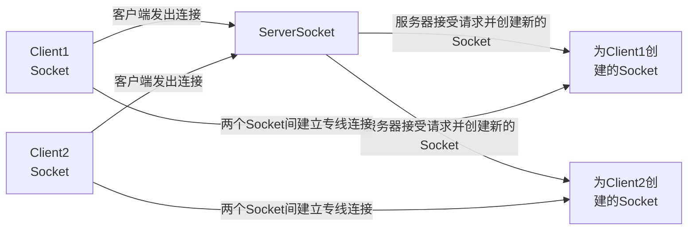

import AlertBlockquote from "../../components/mdx/AlertBlockquote.astro";
import Details from "../../components/mdx/Details.astro";
import TagRoulette from "../../components/mdx/TagRoulette.astro";
import Gallery from "../../components/mdx/Gallery.astro";
import Grid from "../../components/mdx/Grid.astro";
import GridCell from "../../components/mdx/GridCell.astro";
import Tabs from "../../components/mdx/Tabs.astro";
import TabItem from "../../components/mdx/TabItem.astro";
import Link from "../../components/mdx/Link.astro";
import HeatMapCard from "../../components/mdx/HeatMapCard.astro";
import FriendCard from "../../components/mdx/FriendCard.astro";

## Markdown 基本元素

### 标题

# H1

## H2

### H3

#### H4

##### H5

###### H6

### 强调

Emphasis, aka italics, with _asterisks_ or _underscores_.

Strong emphasis, aka bold, with **asterisks** or **underscores**.

Combined emphasis with **asterisks and _underscores_**.

Strikethrough uses two tildes. ~~Scratch this.~~

### 列表

#### Definition List (dl)

<dl>
  <dt>Definition List Title</dt>
  <dd>This is a definition list division.</dd>
</dl>

#### Ordered List (ol)

1. List Item 1
2. List Item 2
3. List Item 3

#### Unordered List (ul)

- List Item 1
- List Item 2
- List Item 3

### 段落

Lorem ipsum dolor sit amet, [test link]() consectetur adipiscing elit. **Strong text** pellentesque ligula commodo viverra vehicula. _Italic text_ at ullamcorper enim. Morbi a euismod nibh. <u>Underline text</u> non elit nisl. ~~Deleted text~~ tristique, sem id condimentum tempus, metus lectus venenatis mauris, sit amet semper lorem felis a eros. Fusce egestas nibh at sagittis auctor. Sed ultricies ac arcu quis molestie. Donec dapibus nunc in nibh egestas, vitae volutpat sem iaculis. Curabitur sem tellus, elementum nec quam id, fermentum laoreet mi. Ut mollis ullamcorper turpis, vitae facilisis velit ultricies sit amet. Etiam laoreet dui odio, id tempus justo tincidunt id. Phasellus scelerisque nunc sed nunc ultricies accumsan.

Interdum et malesuada fames ac ante ipsum primis in faucibus. `Sed erat diam`, blandit eget felis aliquam, rhoncus varius urna. Donec tellus sapien, sodales eget ante vitae, feugiat ullamcorper urna. Praesent auctor dui vitae dapibus eleifend. Proin viverra mollis neque, ut ullamcorper elit posuere eget.

> This is a very long line that will still be quoted properly when it wraps. Oh boy let's keep writing to make sure this is long enough to actually wrap for everyone. Oh, you can _put_ **Markdown** into a blockquote.

Maecenas ornare arcu at mi suscipit, non molestie tortor ultrices. Aenean convallis, diam et congue ultricies, erat magna tincidunt orci, pulvinar posuere mi sapien ac magna. Vestibulum ante ipsum primis in faucibus orci luctus et ultrices posuere cubilia Curae; Praesent vitae placerat mauris. Nullam laoreet ante posuere tortor blandit auctor. Sed id ligula volutpat leo consequat placerat. Mauris fermentum dolor sed augue malesuada sollicitudin. Vivamus ultrices nunc felis, quis viverra orci eleifend ut. Donec et quam id urna cursus posuere. Donec elementum scelerisque laoreet.

### 表格

| Table Header 1 | Table Header 2 | Table Header 3 |
| -------------- | -------------- | -------------- |
| Division 1     | Division 2     | Division 3     |
| Division 1     | Division 2     | Division 3     |
| Division 1     | Division 2     | Division 3     |

| Markdown | Less      | Pretty     |
| -------- | --------- | ---------- |
| _Still_  | `renders` | **nicely** |
| 1        | 2         | 3          |

### 其他元素 - abbr, acronym, sub, sup, kbd, etc.

Lorem <sup>superscript</sup> dolor <sub>subscript</sub> amet, consectetuer adipiscing elit. Nullam dignissim convallis est. Quisque aliquam. <cite>cite</cite>. Nunc iaculis suscipit dui. Nam sit amet sem. Aliquam libero nisi, imperdiet at, tincidunt nec, gravida vehicula, nisl. Praesent mattis, massa quis luctus fermentum, turpis mi volutpat justo, eu volutpat enim diam eget metus. Maecenas ornare tortor. Donec sed tellus eget sapien fringilla nonummy. <acronym title="National Basketball Association">NBA</acronym> Mauris a ante. Suspendisse quam sem, consequat at, commodo vitae, feugiat in, nunc. Morbi imperdiet augue quis tellus. <abbr title="Avenue">AVE</abbr>. Use <kbd>Crtl</kbd> + <kbd>C</kbd> to stop.

### 图片


## 代码块

本主题支持多种编程语言的语法高亮，以下是常用语言的示例：

```javascript title="example.js"
// JavaScript 示例
function greet(name) {
  return `Hello, ${name}!`;
}

const user = {
  name: "World",
  greet: () => greet(user.name),
};

console.log(user.greet());
```

```python title="example.py"
# Python 示例
def fibonacci(n):
    """生成斐波那契数列"""
    if n <= 1:
        return n
    return fibonacci(n-1) + fibonacci(n-2)

# 打印前10个斐波那契数
for i in range(10):
    print(f"F({i}) = {fibonacci(i)}")
```

```html title="example.html"
<!DOCTYPE html>
<html lang="zh-CN">
  <head>
    <meta charset="UTF-8" />
    <title>示例页面</title>
    <style>
      body {
        font-family: Arial, sans-serif;
      }
      .container {
        max-width: 800px;
        margin: 0 auto;
      }
    </style>
  </head>
  <body>
    <div class="container">
      <h1>Hello World</h1>
      <p>这是一个HTML示例。</p>
    </div>
  </body>
</html>
```

```css title="example.css"
/* CSS 示例 */
.container {
  max-width: 1200px;
  margin: 0 auto;
  padding: 20px;
}

.card {
  background: #fff;
  border-radius: 8px;
  box-shadow: 0 2px 10px rgba(0, 0, 0, 0.1);
  transition: transform 0.3s ease;
}

.card:hover {
  transform: translateY(-5px);
}
```

```json title="example.json"
{
  "name": "astro-theme-reimu",
  "version": "1.0.0",
  "description": "A beautiful Astro theme",
  "keywords": ["astro", "theme", "blog"],
  "author": "D-Sketon",
  "license": "MIT",
  "dependencies": {
    "astro": "^4.0.0",
    "@astrojs/mdx": "^3.0.0"
  }
}
```

```bash title="example.sh"
#!/bin/bash

# Bash 脚本示例
echo "开始构建项目..."

# 检查 Node.js 版本
if command -v node &> /dev/null; then
    echo "Node.js 版本: $(node --version)"
else
    echo "未找到 Node.js"
    exit 1
fi

# 安装依赖
npm install

# 构建项目
npm run build

echo "构建完成！"
```

### 代码折叠

本主题支持代码块折叠功能，可以隐藏部分代码以保持页面整洁：

```javascript title="example.js" collapse={1-5, 12-14}
// 这部分代码默认折叠
function setupDatabase() {
  console.log("连接数据库...");
  // 数据库配置代码
  const config = {
    host: "localhost",
    port: 5432,
    database: "myapp"
  };
  return config;
}

// 这部分代码默认展开
function initializeApp() {
  const dbConfig = setupDatabase();
  console.log("应用初始化完成");
  return dbConfig;
}

// 这部分代码也默认折叠
function cleanup() {
  console.log("清理资源...");
  // 清理代码
  process.exit(0);
}

initializeApp();
```

## 数学公式

$f(n) = \Theta(g(n)) \land g(n) = \Theta(h(n)) \rightarrow f(n) = \Theta(h(n))$

$\omega(g(n))=\{f(n):\text{存在正常量}c\text{和}n_0\text{，使得对所有}n \geq n_0\text{，有}0\leq cg(n) < f(n)\}$

$$
f^{(i)}(n) =
\begin{cases}
n \qquad & i = 1 \\
f(f^{(i-1)}(n)) \qquad &  i>1
\end{cases}
$$

$$
A = \begin{bmatrix}
A_{11} & A_{12} \\
A_{21} & A_{22}
\end{bmatrix}
,
B = \begin{bmatrix}
B_{11} & B_{12} \\
B_{21} & B_{22}
\end{bmatrix}
,
C = \begin{bmatrix}
C_{11} & C_{12} \\
C_{21} & C_{22}
\end{bmatrix}
$$

$$\sum^{\lfloor lgn \rfloor}_{h=0} \lceil \frac{n}{2^{h+1}} \rceil O(h) = O(n \sum^{\lfloor lgn \rfloor}_{h=0} \frac{h}{2^h}) =  O(n \sum^{\infty}_{h=0} \frac{h}{2^h}) =O(n)$$

## 流程图





## MDX 组件展示

本主题提供了丰富的内置 MDX 组件，以下是各组件的使用示例和效果展示。

### Link 组件

#### 内部链接

内部链接组件可以创建美观的文章链接卡片，显示文章标题、封面和摘要。


```markdown
<Link slug="astro-theme-reimu-content" title="astro-theme-reimu效果展示" cover="https://d-sketon.top/img/backwebp/bg1.webp" />
```

<Link
  slug="astro-theme-reimu-content"
  title="astro-theme-reimu效果展示"
  cover="https://d-sketon.top/img/backwebp/bg1.webp"
/>

#### 外部链接

外部链接组件会自动识别为外部链接，创建美观的外部网站链接卡片。


```markdown
<Link url="https://github.com/D-Sketon/astro-theme-reimu" title="astro-theme-reimu" cover="auto" />
```

<Link
  url="https://github.com/D-Sketon/astro-theme-reimu"
  title="astro-theme-reimu"
  cover="auto"
/>

### FriendCard 组件

友链卡片组件显示友情链接列表，每个链接包含头像、名称和描述。


```markdown
<FriendCard />
```

<FriendCard />

### HeatMapCard 组件

热力图卡片组件基于访问数据生成热力图可视化，显示内容活跃度。


```markdown
<HeatMapCard levelStandard="1000,5000,10000" />
```

<HeatMapCard levelStandard="1000,5000,10000" />

### TagRoulette 组件

标签轮盘组件以轮盘形式显示标签列表，点击可以随机选择标签。


```markdown
<TagRoulette tags="Astro,React,TypeScript,MDX,Vite" icon="🎯" />
```

<TagRoulette tags="Astro,React,TypeScript,MDX,Vite" icon="🎯" />

### Tabs 组件

标签页组件创建多标签界面，在同一区域显示不同内容。


```markdown
<Tabs active={1} center={false}>
  <TabItem title="Tab 1">这是第一个标签页的内容</TabItem>
  <TabItem title="Tab 2">这是第二个标签页的内容</TabItem>
  <TabItem title="Tab 3">这是第三个标签页的内容</TabItem>
</Tabs>
```

<Tabs active={1} center={false}>
  <TabItem title="Tab 1">这是第一个标签页的内容</TabItem>
  <TabItem title="Tab 2">这是第二个标签页的内容</TabItem>
  <TabItem title="Tab 3">这是第三个标签页的内容</TabItem>
</Tabs>

### Details 组件

详情折叠组件创建可展开/折叠的内容区域，用于隐藏次要信息。


```markdown
<Details summary="点击展开更多信息">
这里是折叠的内容。你可以在这里放置任何 Markdown 内容，包括**粗体**、_斜体_、[链接](https://example.com)等。

- 列表项 1
- 列表项 2
- 列表项 3
</Details>
```

<Details summary="点击展开更多信息">
这里是折叠的内容。你可以在这里放置任何 Markdown 内容，包括**粗体**、_斜体_、[链接](https://example.com)等。

- 列表项 1
- 列表项 2
- 列表项 3
  
</Details>

### Grid 组件

网格布局组件创建响应式网格布局，用于灵活的内容排列。


```markdown
<Grid col={3}>
  <GridCell>
    <h3>卡片 1</h3>
    <p>这是第一个网格单元格的内容</p>
  </GridCell>
  <GridCell>
    <h3>卡片 2</h3>
    <p>这是第二个网格单元格的内容</p>
  </GridCell>
  <GridCell>
    <h3>卡片 3</h3>
    <p>这是第三个网格单元格的内容</p>
  </GridCell>
</Grid>
```

<Grid col={3}>
  <GridCell>
    <h3>卡片 1</h3>
    <p>这是第一个网格单元格的内容</p>
  </GridCell>
  <GridCell>
    <h3>卡片 2</h3>
    <p>这是第二个网格单元格的内容</p>
  </GridCell>
  <GridCell>
    <h3>卡片 3</h3>
    <p>这是第三个网格单元格的内容</p>
  </GridCell>
</Grid>

### Gallery 组件

图片画廊组件创建带有灯箱效果的美观图像展示墙。

```markdown
<Gallery>
  
  
  
</Gallery>
```

<Gallery>
    
</Gallery>

### AlertBlockquote 组件

提示信息框组件创建不同类型的提示信息，具有各种样式。


```markdown
<AlertBlockquote type="info" title="提示">
这是一个信息提示框，用于显示一般性信息。
</AlertBlockquote>

<AlertBlockquote type="warning">
这是一个警告提示框，用于显示警告信息。
</AlertBlockquote>

<AlertBlockquote type="danger">
这是一个危险提示框，用于显示错误或危险信息。
</AlertBlockquote>

<AlertBlockquote type="tip" title="小贴士">
这是一个小贴士提示框，用于显示有用的提示信息。
</AlertBlockquote>

<AlertBlockquote type="important">
这是一个重要提示框，用于显示重要信息。
</AlertBlockquote>
```

<AlertBlockquote type="info" title="提示">
  这是一个信息提示框，用于显示一般性信息。
</AlertBlockquote>

<AlertBlockquote type="warning">
  这是一个警告提示框，用于显示警告信息。
</AlertBlockquote>

<AlertBlockquote type="danger">
  这是一个危险提示框，用于显示错误或危险信息。
</AlertBlockquote>

<AlertBlockquote type="tip" title="小贴士">
  这是一个小贴士提示框，用于显示有用的提示信息。
</AlertBlockquote>

<AlertBlockquote type="important">
  这是一个重要提示框，用于显示重要信息。
</AlertBlockquote>
